# malaysia-pii-guard


A Python library for detecting and masking Malaysian PII. It supports MyKad
numbers, Malaysian phone numbers, passport numbers, bank account numbers, and
email addresses.

## How it works

| PII | How it works |
| --- | --- |
| MyKad / NRIC | Finds 12-digit numbers in dashed, spaced, or plain formats, then checks for a valid birth date and Malaysian state code. |
| Phone number | Uses Malaysia's numbering plan to detect valid Malaysian phone numbers. |
| Passport number | Finds one letter followed by eight digits, checks known Malaysian prefixes, and uses nearby passport-related words for context. |
| Bank account number | Finds 10–16 digit numbers and uses nearby banking-related words to reduce false matches. |
| Email address | Finds valid email formats and checks that the domain ends with a recognised public suffix. |

## Quick start

```bash
uvx malaysia-pii-guard
```

Opens a page on http://127.0.0.1:8765 that masks as you type.



## Usage

Add it to your project:

```bash
uv add malaysia-pii-guard
```

Then, in a script you run with `uv run`:

```python
from malaysia_pii_guard import AnalyzerEngine, AnonymizerEngine, DeanonymizeEngine

analyzer = AnalyzerEngine(score_threshold=0.4)
anonymizer = AnonymizerEngine()
deanonymizer = DeanonymizeEngine()

text = "IC 880101-14-5523, mobile 012-345 6789, email siti@example.com.my"
result = anonymizer.anonymize(text, analyzer.analyze(text))

print(result.text)
# IC <MY_NRIC_0>, mobile <PHONE_NUMBER_0>, email <EMAIL_ADDRESS_0>

print(deanonymizer.deanonymize(result.text, result.items))
# IC 880101-14-5523, mobile 012-345 6789, email siti@example.com.my
```

Not using uv? `pip install malaysia-pii-guard` works the same, inside a virtualenv.

## License

MIT
