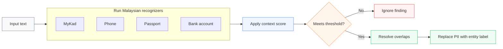

# pii-guard

A Python library for detecting and masking Malaysian PII.

It supports MyKad numbers, Malaysian phone numbers, passport numbers, and bank account numbers.

## Install

```bash
pip install -e .
```

Python 3.9 or newer is required.

## Usage

```python
from pii_guard import malaysian_analyzer, anonymize

analyzer = malaysian_analyzer(score_threshold=0.4)
text = "IC 880101-14-5523, mobile 012-345 6789"

findings = analyzer.analyze(text)
result = anonymize(text, findings)

print(result)
# IC <MY_NRIC>, mobile <PHONE_NUMBER>
```

## How it works



Each recognizer finds possible PII and gives it a confidence score. Nearby words such as `IC`, `mobile`, or `account` can increase that score. Findings below the selected threshold are ignored. When findings overlap, the strongest one is used.

## Supported entities

| Entity | Detects | Validation |
|---|---|---|
| `MY_NRIC` | MyKad and NRIC numbers | Checks the date and state code |
| `PHONE_NUMBER` | Malaysian phone numbers | Uses the Malaysian numbering plan |
| `MY_PASSPORT` | Malaysian passport numbers | Checks the format and prefix |
| `MY_BANK_ACCOUNT` | Bank account numbers | Uses format and nearby context |

## Tests

```bash
pip install -e '.[test]'
pytest -q
```
