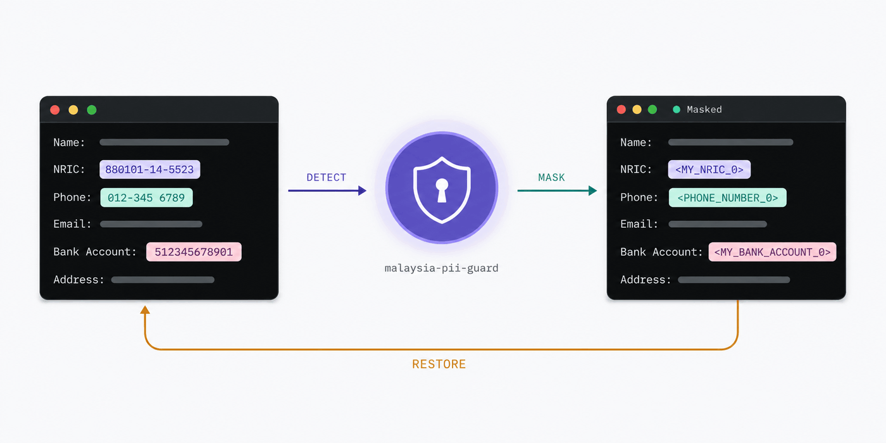
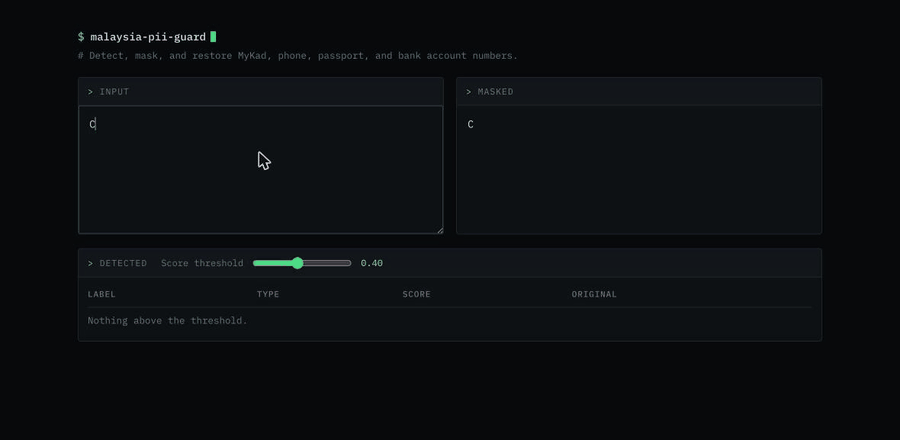

# malaysia-pii-guard



A Python library for detecting and masking Malaysian PII. It supports MyKad
numbers, Malaysian phone numbers, passport numbers, and bank account numbers.

## Quick start

```bash
python -m malaysia_pii_guard
```

Opens a page on http://127.0.0.1:8765 that masks as you type.

[](assets/demo.gif)

## Usage

```python
from malaysia_pii_guard import AnalyzerEngine, AnonymizerEngine, DeanonymizeEngine

analyzer = AnalyzerEngine(score_threshold=0.4)
anonymizer = AnonymizerEngine()
deanonymizer = DeanonymizeEngine()

text = "IC 880101-14-5523, mobile 012-345 6789"
result = anonymizer.anonymize(text, analyzer.analyze(text))

print(result.text)
# IC <MY_NRIC_0>, mobile <PHONE_NUMBER_0>

print(deanonymizer.deanonymize(result.text, result.items))
# IC 880101-14-5523, mobile 012-345 6789
```

## License

MIT
